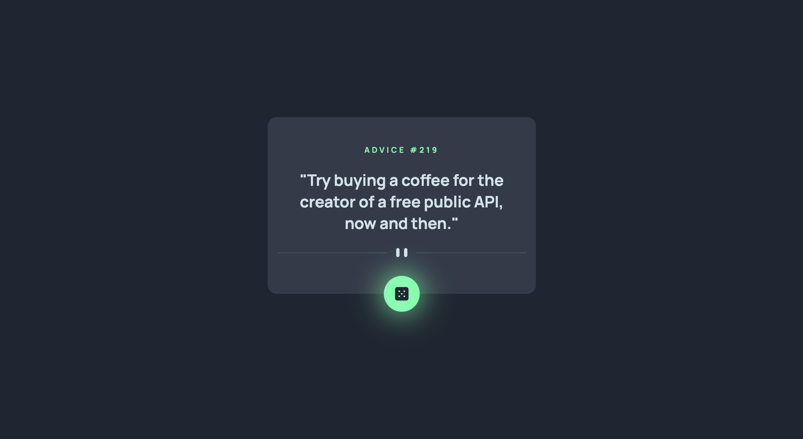

# Advice generator app 

## Table of contents

- [Overview](#overview)
  - [The App](#the-app)
  - [What it looks like](#what-it-looks-like)
  - [How to run the app ?](#how-to-run-the-app)
- [My process](#my-process)
  - [Built with](#built-with)
  - [What I learned](#what-i-learned)
  - [Continued development](#continued-development)

## Overview

### The App

This app generates wise advices every time you click on the dice button. It is fully responsive.

Check it out here : https://advice-generator-v2.surge.sh/

### What it looks like



### How to run the app locally ? 

Clone the project, then jump into your command line and run these :

```bash
# install dependencies
yarn

# start the application
yarn start

# open the application in the browser
open http://localhost:3000
```

## My process

### Built with

- Semantic HTML5 markup
- CSS custom properties
- Flexbox
- SCSS
- Mobile-first workflow
- [React](https://reactjs.org/) - JS library
- [Typescript](https://www.typescriptlang.org/) - JS with an emphasis on types

### What I learned

This app is pretty light in the logic side of the code (hence TS), I mostly improved in my CSS (SCSS in this case) skills while coding this project.

Using SCSS, I learned how to create mixins :

```scss
@mixin mq-mobile {
  @media screen and (max-width: $mq-mobile) {
    @content;
  }
}
```

And how to use them in my other .scss files like so : 

 ```scss
 @import '../../styles/mixins';
 ```

### Continued development

As you can see there is a little issue with the hover state of the button in the mobile version. I will try to improve the behavior of the button in order to improve the UX on smartphone devices.
